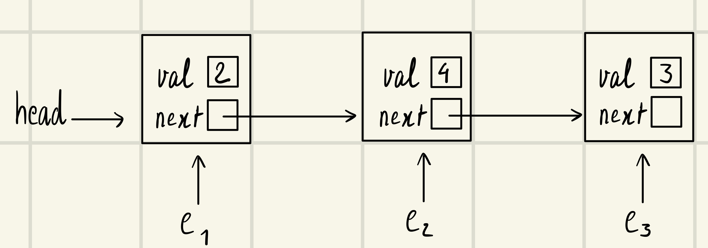

# Python Pass By Oject Reference

Coming from a programming language that requires a thorough understanding of the difference "passing by value" and "passing by reference" like C/C++, the concept of "pass by object reference" in Python had me puzzled. One of the reasons why I chose to be proficient in Python is so that I do not have to think about pointers and references and dereferences and all that mess. But now that I need to solve a problem on Leetcode that has to do with LinkedList, I cannot help but wishing Python had a clear distinguish between "passing by value" and "passing by reference".

To understand better how Python hanldes passing an object as an argument to a funtion, I have created the code snippet below.

First, the ListNode class with member variables `val` and `next` where `val` holds the value of the node and `next` points to the next ListNode object.

Defining a `ListNode` class and a function to print all the nodes of a Linked List:

```python
# Definition for singly-linked list.
class ListNode:
    def __init__(self, val=0, next=None):
        self.val = val
        self.next = next
    def __str__(self):
        return str(self.val)
        
def printLinkedList(m_head): while m_head != None: print(m_head.val) m_head = m_head.next
```

Creating a Linked List using a series of `ListNode` objects

```python
e1 = ListNode(2)
e2 = ListNode(4)
e3 = ListNode(3)
e1.next = e2
e2.next = e3
head = e1
```

We will then have:



Note that `head` points to the actual object, not the variable name `e1`. It is important to over clarify this because this is different from using assignment `=` for an immutable object like integers or strings. For example:

```python
a = 4
b = a
print("a is" + str(a))
print("b is" + str(b))
```
```
a is 4
b is 4
```

Now we change the value of `a`, what do you think the value of `b` is?

```python
a = 5
print("a is" + str(a))
print("b is" + str(b))
```

Would `b` change to 5 too or would it stay the same i.e. 4?

```
a is 5
b is 4
```

`b` is still 4 because the assignment `b = a` is a pass-by-value operation. In contrast, in the Linked List example above, `head = e1` is a pass-by-reference operation where changing in `e1` will also cause `head` to change since both `e1` and `head` points to the same object.

The current Linked List is:

```python
printLinkedList(head)
```
Output:

```
2
4
3
```

Now, if we have a function that increments each value of the Linked List's nodes by 1, it is intuitive to think that the argument of the function is passed by reference; in which case you would be right!

```python
def incrementLinkedList(m_head):
    while m_head != None:
        m_head.val += 1
        m_head = m_head.next


incrementLinkedList(head)
printLinkedList(head)
```
Output:

```
3
5
4
```
Checking if `e1`, `e2`, and `e3` changed due to incrementing values in the Linked List pointed to by `head`

```python
print(e1)
print(e2)
print(e3)
```
Output:
```
3
5
4
```

This confirms our intution of pass-by-reference for mutable objects.
